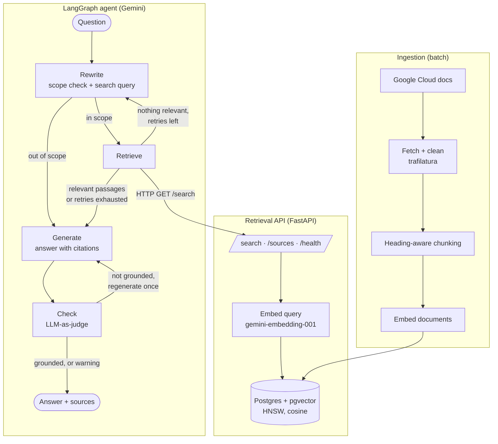

# Agentic Knowledge Assistant

An agentic RAG (retrieval-augmented generation) assistant that answers questions about Google Cloud
using its official documentation. It doesn't just search once and answer: a **LangGraph** agent
running on **Gemini** rewrites vague questions into documentation terms, checks whether a question
is in scope, retries searches with feedback, and answers **only** from retrieved passages, with citations.

> **Status:** work in progress. Ingestion, the retrieval API and the agent (query rewriting, retry loop,
> grounding check) are working locally. Cloud Run deployment is next. See [Roadmap](#roadmap).

```
$ python -m scripts.ask "my container can't read the db password"

[rewrite]  attempt 1: "Cloud Run configure secrets Secret Manager database password"
[retrieve] 5 relevant passages
           0.80  postgres/connect-run
           0.78  services/secrets
           ...
[generate] answer written

A: To make a database password accessible to your Cloud Run container ...
   * Grant access permissions: the service account must have access to the secret in Secret Manager [4].
   * As an environment variable: --update-secrets=DB_PASS=DB_PASS_SECRET:latest ... [1][3][4]
   * Mounted as a volume: ... always fetches the latest version from Secret Manager [1][2].

Sources:
  - https://docs.cloud.google.com/sql/docs/postgres/connect-run
  - https://docs.cloud.google.com/run/docs/configuring/services/secrets
```

## Architecture



## How it works

### 1. Ingestion (`scripts/fetch_docs.py`, `scripts/ingest.py`)
- Downloads the doc pages listed in `data/sources.txt` and strips navigation and boilerplate, keeping clean Markdown with the source URL.
- **Chunks by structure first, size second:** splits on Markdown headings, then packs paragraphs up to ~1000 characters with 150 characters of overlap.
- Prefixes every chunk with `document title > section path`, so a chunk like "set the volume name" still carries its context into the embedding and citations.
- Embeds with `gemini-embedding-001` (768 dimensions, `RETRIEVAL_DOCUMENT` task type) and stores the vectors in Postgres/pgvector.
- **Idempotent:** a SHA-256 hash of each chunk is checked *before* embedding, so re-runs only pay for new or changed content. A `UNIQUE` constraint with `ON CONFLICT DO NOTHING` guarantees no duplicates. Retries with exponential backoff on rate limits.

### 2. Retrieval API (`app/api.py`, `app/retrieval.py`)
- `GET /search?q=...` embeds the question (`RETRIEVAL_QUERY` task type) and returns the closest chunks by **cosine similarity**, using an **HNSW** index.
- **Relevance threshold chosen by measurement:** relevant matches scored ~0.72–0.80 and off-topic questions ~0.51, so `MIN_SCORE` defaults to 0.6. Vector search always returns *something*; the threshold is what lets the system say "I don't know".
- Connection pooling, request validation and typed responses (Pydantic), and auto-generated OpenAPI docs at `/docs`.

### 3. Agent (`app/agent.py`)
A LangGraph state machine with explicit, bounded control flow:

| Node | What it does |
|---|---|
| **rewrite** | Gemini returns structured output `{in_scope, query}`: decides whether the question is about Google Cloud, and maps the user's wording onto the documentation's wording. The prompt includes the list of document titles (from `/sources`), rules and a few-shot example. On retry it gets feedback (previous query, best score). |
| **retrieve** | Calls the retrieval API with **both** the rewritten query and the original question, merges results, applies the threshold. |
| **generate** | Gemini answers **only** from the numbered passages, cites every claim as `[n]`, and says what the passages don't cover. Only cited sources are returned. When regenerating, it is told exactly which statements the judge rejected. |
| **check** | **LLM-as-judge:** a separate Gemini call (temperature 0, configurable `JUDGE_MODEL`) verifies each statement against the passages, including whether the cited passage really contains it. Not grounded → regenerate once; still not grounded → return the answer with a visible warning. |

Conditional edges route out-of-scope questions straight to a refusal (no search, no extra cost), and loop back to `rewrite` at most `MAX_REWRITES` times when nothing relevant is found.

## Design decisions

- **Explicit agent loop over SDK auto function calling.** LangGraph owns the control flow, so every step is visible, bounded and testable. The SDK's automatic function calling is disabled.
- **Retrieval as a separate HTTP service.** The agent calls `/search` like any other tool, so search and reasoning can be scaled, deployed and replaced independently.
- **No LangChain model wrappers.** Gemini is called through the `google-genai` SDK directly inside the graph nodes, which keeps prompts and parameters explicit.
- **EU data residency.** Embeddings run in `europe-west1`; generation uses the `global` endpoint.
- **Failure modes found by reading traces, and fixed:**
  - An over-strict "not found" rule made the agent refuse even with good passages → replaced with a partial-answer rule.
  - **Query drift:** on retry, the rewriter changed an off-topic question into an on-topic one to match the knowledge base → added the `in_scope` decision, a conditional edge that skips search, and a "preserve the user's intent" rule.

## Testing the grounding check

`python -m scripts.test_judge` calls the `check` node directly with fixed passages and answers whose
correct verdict is known:

| Case | Expected | Proves |
|---|---|---|
| Correct answer | grounded | accepts good answers |
| Same answer + a planted fabricated claim | not grounded | catches invented facts |
| Faithful paraphrase | grounded | doesn't over-flag different wording |
| Correct fact, wrong passage cited | not grounded | checks citations, not just content |

Current result: **4/4 passed**.

## Tech stack

Python · LangGraph · FastAPI · Gemini 3.8 Flash and gemini-embedding-001 via the `google-genai` SDK on
**Gemini Enterprise Agent Platform** (formerly Vertex AI) · PostgreSQL 17 + pgvector · Docker Compose ·
psycopg 3 · trafilatura

## Run it locally

**Prerequisites:** Python 3.10+, Docker, the `gcloud` CLI, and a Google Cloud project with billing enabled.

```bash
# 1. Google Cloud auth
gcloud auth application-default login
gcloud services enable aiplatform.googleapis.com

# 2. Python environment
python3 -m venv .venv && source .venv/bin/activate
pip install -r requirements.txt

# 3. Config: set GOOGLE_CLOUD_PROJECT, then let the smoke test find working model IDs
cp .env.example .env
python scripts/check_vertex.py          # copy the suggested GEMINI_MODEL / EMBEDDING_MODEL into .env

# 4. Database (Postgres + pgvector on localhost:5433)
docker compose up -d

# 5. Ingest the docs (data/docs/ is committed; run fetch_docs.py only to refresh it)
python -m scripts.ingest --dry-run      # inspect chunks, no API calls
python -m scripts.ingest

# 6. Start the retrieval API (terminal 1), then ask the agent (terminal 2)
uvicorn app.api:app --reload            # Swagger UI at http://localhost:8000/docs
python -m scripts.ask "How do I give a Cloud Run service access to a secret?"

# 7. Test the grounding check (needs Gemini access only, not the DB or API)
python -m scripts.test_judge
```

## Project structure

```
app/
  config.py       settings from .env
  chunking.py     heading-aware Markdown chunking
  embeddings.py   Gemini embeddings (document vs query task types, retries)
  db.py           Postgres connection with pgvector support
  retrieval.py    semantic search (pgvector, cosine, connection pool)
  api.py          FastAPI retrieval service
  llm.py          Gemini generation, incl. structured (Pydantic) output
  agent.py        LangGraph agent: rewrite -> retrieve -> generate -> check
scripts/
  check_vertex.py smoke test: finds model IDs that work in your project/region
  fetch_docs.py   download and clean the doc pages in data/sources.txt
  ingest.py       load -> chunk -> embed -> store
  ask.py          ask the agent from the terminal and watch each step
  test_judge.py   tests the grounding check with known-good and known-bad answers
db/init.sql       schema + HNSW index
data/             doc sources and downloaded Markdown
```

## Roadmap

- [x] Google Cloud setup and model smoke test
- [x] Ingestion pipeline (chunk, embed, store; idempotent)
- [x] Retrieval API with measured relevance threshold
- [x] LangGraph agent: retrieve and generate with citations
- [x] Query rewriting, scope check and bounded retry loop
- [x] Grounding check: Gemini as a judge verifies every claim against the passages, regenerates once if needed
- [ ] Deploy to Cloud Run with Cloud SQL (`POST /ask`)
- [ ] Evaluation set (20–30 questions) to measure retrieval and answer quality
- [ ] Remove stale chunks when a source document changes

## Data and license

The documents in `data/docs/` are from the [Google Cloud documentation](https://cloud.google.com/docs),
licensed under [CC BY 4.0](https://creativecommons.org/licenses/by/4.0/). Each file keeps its source URL.
